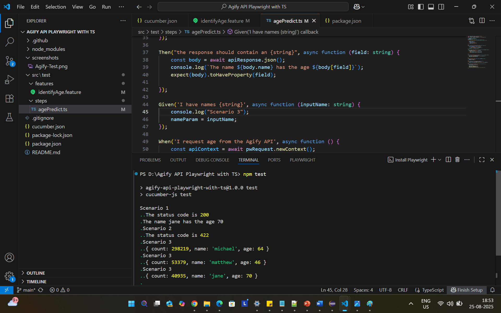

# Agify API Testing with Playwright & TypeScript

## Project Overview
This project contains automated tests for the [Agify.io](https://agify.io) API using Playwright, TypeScript, and Cucumber (BDD).

## Installation 
- Node Version: v22.16.0
- NPM Version: 10.9.2

## Features
- Feature name: identifyAge.feature  
It has the below 2 scenarios  
- To predict age by entering name of a person
- Agify API - Predict ages for names

## Run
### Run the below command in the commandline
npm test

## Project Structure
src/  
 ├─ test/ 
 │   ├─ steps/        # Cucumber step definitions  
 │   ├─ features/     # Feature files  

cucumber.json file links the Feature file with the Step Definition  

## Notes

Increase step timeout for API calls if network is slow

## Test Screenshot

Here’s a screenshot of the test run:

